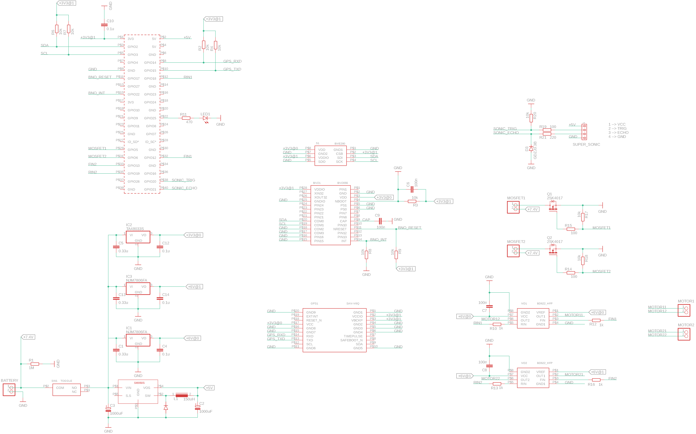

# ハードウェアとインターフェイス

## 回路図

回路図は[ドライブ](https://drive.google.com/drive/u/3/folders/1yeRXrsquoPqAf5KEmQhBFVWh2i_2MZr4)から参照可能です．
図が見づらい場合はそちらを参照してください．

### 親機

### 子機

## インターフェイス

### 親機

親機の Raspberry Pi のインターフェイスは以下のとおりです．

- I2C (BNO055, BME280)
- UART (SAM-M8Q)
- GPIO13, GPIO19, GPIO18, GPIO12 (モータドライバ)
- GPIO5, GPIO6 (電熱線用 MOSFET)
- GPIO20, GPIO21 (超音波センサ)
- GPIO17 (BNO055 リセット用)
- GPIO22 (BNO055 割り込み用)
- USB0 (IM920)

それぞれの概要については以下に示すとおりです．

#### I2C

I2C は BNO055 (9軸慣性センサ)，BME280 (気圧温湿度センサ) を利用するために用います．
I2C による信号処理のためには pisat.handler.PigpioI2CHandler を用います．
センサの利用は pisat.sensor.Bno055，pisat.sensor.Bme280 クラスを用います．

#### UART

UART は GPS 受信モジュールである SAM-M8Q を利用するために用います．
UART の処理には pisat.handler.PyserialSerialHandler を用います．
GPS モジュールの利用には pisat.sensor.SamM8Q クラスを用います．

#### GPIO13, GPIO19, GPIO18, GPIO12

これらの GPIO ピンは PWM 出力用に用います．
モータドライバは BD6222HFP です．
PWM の出力は pisat.handler.PygpioPWMHandler を用います．
2つのモータドライバは1つの二輪車として pisat.actuator.TwoWheels クラスを用いて操作します．

#### GPIO5, GPIO6

これらの GPIO ピンは MOSFET を動作させるために使用します．
pisat.handler.PigpioDigitalOutput クラスを直接用いて操作します．

MOSFET はこれらの GPIO ピンの電圧レベルを HIGH にすると動作し，電熱線に電流を流します．
つまり，テグスを焼きたいときに GPIO ピンの電圧レベルを HIGH にします．

#### GPIO20, GPIO21

これらの GPIO ピンは超音波センサを利用するために使用します．
GPIO20 は超音波センサへトリガーを送るためのデジタル出力ピンとして用います．
GPIO21 は超音波センサから返される信号を読み取るためのデジタル入力ピンとして用います．

#### GPIO17

このピンはデジタル出力として用います．
デフォルトの電圧レベルは HIGH です．
BNO055 をリセットさせる際には電圧レベルを LOW にします．

#### GPIO 22

このピンはデジタル入力として用います．
BNO055 の割り込み機能を利用する場合に用いるピンです．
割り込みが検出されると電圧レベルが HIGH になるため，これを検出することで割り込みを処理できます．

#### USB0

この USB は IM920 を利用するために使用します．
USB の使用には pisat.handler.PyserialSerialHandler を利用します．
IM920 をソケット感覚で使用したい場合は SocketTransceiver クラスでラップする必要があります．

### 子機

子機の Raspberry Pi のインターフェイスは以下のとおりです．

- I2C (BME280, OPT3002)
- UART (SAM-M8Q)
- USB0 (IM920)

#### I2C

I2C は BME280 (気圧温湿度センサ), OPT3002 (光センサ) を利用するために用います．
I2C による信号処理のためには pisat.handler.PigpioI2CHandler を用います．
センサの利用は pisat.sensor.Bme280, pisat.sensor.Opt3002 クラスを用います．

#### UART

UART は GPS 受信モジュールである SAM-M8Q を利用するために用います．
UART の処理には pisat.handler.PyserialSerialHandler を用います．
GPS モジュールの利用には pisat.sensor.SamM8Q クラスを用います．

#### USB0

この USB は IM920 を利用するために使用します．
USB の使用には pisat.handler.PyserialSerialHandler を利用します．
IM920 をソケット感覚で使用したい場合は SocketTransceiver クラスでラップする必要があります．

## 開発の際に

開発の際にはハードウェアを利用する Node も多くあるかと思います．

まずセンサですが，**センサを明示的に利用することは避けてください**．
ただし，センサの設定を変えたい場合は別です．
そのような場合は，Node.enter コールバックで行ってください．
なぜなら，Node.judge ではセンサは常に Main スレッドに拘束されているからです．

一方，モータや通信機は特定のスレッドに拘束されていませんので，基本的には自由に使うことが出来ます．
特に Node.control 内で利用するのが良いです．

ハードウェアの部品変更があり，pisat のコンポーネントが追いついていないものがありますが，
それぞれの**基底クラス (Base の名前がついているクラス) は既に完成済み**です．
実際に使うことになる具象クラスは基底クラスのメソッドを持っているので，
具象クラスが完成していなくてもコード自体は書けます (具象クラスの実装を行うのは pisat 管理者の役目です)．

## 部品ークラス対応表

9/30 時点での部品とクラスの対応表は以下のとおりです．

| 部品名    | 具象クラス | 基底クラス                  | 具象クラスの実装状態
:----------:|:----------:|:---------------------------:|:----------------------------:
BNO055      | Bno055     | SensorBase                  | 未
BME280      | Bme280     | SensorBase                  | 済
OPT3002     | Opt3002    | SensorBase                  | 未
SAM-M8Q     | SamM8Q     | SensorBase                  | 未
*BD6222HFP  | BD62xx     | SimplePWMDCMotorDriver      | 済
IM920       | Im920      | TransceiverBase             | 済

(*注) BD62xx クラスは単体で使用せず，TwoWheels クラスを利用してください．
ただし，TwoWheels クラス生成の際に BD62xx オブジェクトが2つ必要になります．

## まとめ

ここではソフトウェア開発に必要な最低限のハードウェアの内容を説明しました．
ソフトウェアはハードウェアの抽象化の上に構築されるので，特に内部の実装に気を配る必要はありません．
ただし，抽象化されたクラスの使い方には習熟しておく必要があります．
その使い方は具象クラスの docstring などを読めばわかります．
もし，具象クラスが未実装の場合はその基底クラスを見れば大体の使い方を知ることが出来ます．

[次のドキュメント](./test.md)ではテスト方法について説明します．
